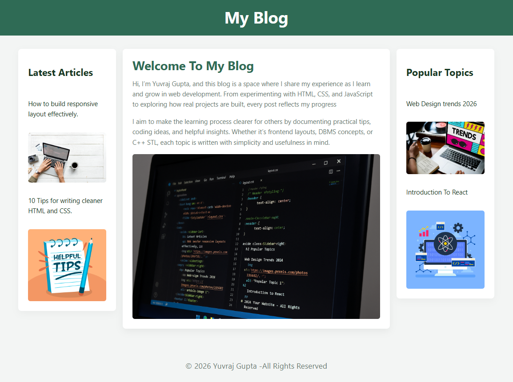

# My Blog – Responsive Web Layout

A responsive, clean, and modern three-column blog layout built with HTML and CSS. This project demonstrates a fully adaptive layout using CSS Grid, accessible typography, and a well-structured design suitable for beginners and intermediate developers learning frontend development.

The blog contains a header, main content section, left and right sidebars, and a global footer. It is styled with a custom design system defined using CSS variables.
Source reference:  

---

## Features

* Fully responsive three-column layout using CSS Grid.
* Clean typography with CSS variables for color, spacing, and radius tokens.
* Left sidebar for latest articles; right sidebar for popular topics.
* Main content area introducing the author and purpose of the blog.
* Minimalistic, professional UI with soft shadows and rounded components.
* Mobile-first design optimized for readability.

---

## Tech Stack

* HTML5
* CSS3 (Grid Layout, Variables, Responsive Design)

---

## Project Structure

```
├── index.html          # Main HTML structure (blog layout)
├── layout.css          # Styling and responsive grid
└── images/             # Blog images referenced in the layout
```

---

## How to Run

Option 1: Clone the repository
git clone https://github.com/yuv-12/my-blog-project.git

Option 2: Download ZIP

Download and extract:

https://github.com/yuv-12/my-blog-project/archive/refs/heads/main.zip

Option 3: View Live (GitHub Pages)
https://yuv-12.github.io/my-blog-project/


After downloading or cloning, open index.html in any modern browser.
No build tools or dependencies required.

## Screenshots



---
---

## Author

**Yuvraj Gupta**
A learner exploring web development, frontend layouts, DBMS concepts, and C++ STL through hands-on projects.

---
